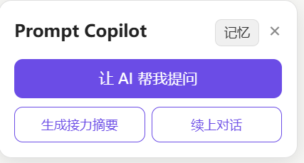

# Prompt Copilot

> A browser extension that acts as a "copilot" for general-purpose LLM websites (ChatGPT, Claude, DeepSeek, Doubao, etc.). While you chat with an AI, it helps you turn vague ideas into clear, effective prompts, remembers who you are and what you're working on, and lets you seamlessly hand off a conversation to another LLM.
>
> 一个浏览器扩展，作为通用 LLM 网站（ChatGPT、Claude、DeepSeek、豆包等）的"对话副驾"。它在你与 AI 对话时，帮你把模糊的想法变成清晰有效的提问、记住你是谁和在做什么、并能把一个对话无缝接力到另一个 LLM。

**Helping people who aren't familiar with AI communicate with it more accurately and effectively.**

**让不熟悉 AI 的人也能更准确、更高效地与 AI 沟通。**

[](https://opensource.org/licenses/Apache-2.0)



---

## The Problem / 它解决什么问题

Many people freeze when facing an AI input box: they don't know how to describe what they want, they have to re-explain context every time, and when a conversation gets too long or hits a quota limit, they're forced to start over from scratch. Prompt Copilot doesn't take over the chat interface — it works as a sidebar copilot on the AI websites you already use, solving these problems right there.

很多人面对 AI 输入框时会卡住：不知道怎么描述需求、每次都要重复交代背景、对话太长或额度用完后被迫另起对话却要从头说起。Prompt Copilot 不抢占对话界面，而是作为一个侧边栏副驾，在你习惯的 AI 网站上帮你解决这些问题。

## Core Features / 核心功能

**🤖 AI Helps You Ask — Better Prompt Generation**

No more staring at a blank box trying to craft the perfect prompt. With one click, the AI reads what you're typing and your conversation context, then asks a few short multiple-choice questions to clarify your needs. After you answer, it assembles them into a coherent, natural, more effective prompt and fills it straight into the input box.

**🤖 AI 帮你提问，生成更好的 Prompt**

不用对着空白输入框憋一个好 prompt。点一下，AI 会结合你正在输入的内容和对话上下文，提出几个带选项的简短问题帮你理清需求；你点选回答后，它把这些组装成一段连贯、自然、更有效的提问，直接填进输入框。

**🧠 Cross-Session Memory — Remembers Who You Are**

Two layers of memory, each with its own job:
- **User Profile** — remembers your identity, knowledge level, and communication preferences (which decides how the AI should talk to you, e.g. whether to explain jargon).
- **Conversation Context** — remembers the objective facts of your current project: core requirements, technical environment, and current progress.

Memory is automatically extracted, distilled, and updated by AI, and you can view and edit it anytime in the panel.

**🧠 跨会话记忆：记住你是谁、在做什么**

两层记忆，各司其职：
- **用户画像** —— 记住你的身份、认知水平、沟通偏好（决定 AI 该用什么方式跟你说话，比如要不要解释术语）。
- **对话背景** —— 记住当前项目的客观事实：核心需求、技术环境、当前进展。

记忆由 AI 自动提炼、蒸馏、更新，你也能随时在面板里查看和修改。

**🔄 Conversation Handoff — Continue in Another LLM**

When a conversation gets too long, hits a quota, or you simply want to switch to another AI, click "Generate Handoff Summary" and the extension packages the conversation into a handover note. In a new conversation or a new LLM, click "Resume Conversation" and the new AI picks up seamlessly — no need to re-explain everything. This is cross-platform capability that no single LLM platform can offer.

**🔄 对话接力：把对话续到另一个 LLM**

当一个对话太长、额度用完、或你想换个 AI 继续时，点"生成接力摘要"，扩展会把对话打包成一份交接说明；在新对话或新 LLM 里点"续上对话"，新的 AI 就能无缝接手——不用再从头交代背景。这是单个 LLM 平台做不到的跨平台能力。

**🌐 Multi-LLM Support**

Supports multiple AI websites through an adapter layer. Adding a new site only requires writing one adapter, without touching the core logic.

**🌐 多 LLM 支持**

通过适配层支持多个 AI 网站。新增网站只需写一个适配器，不影响核心逻辑。

**🔒 Local-First, Privacy-Conscious**

All memory and config are stored only in your local browser by default; it only connects to the network when calling an LLM. Your own API key is stored encrypted locally.

**🔒 本地优先，隐私可控**

所有记忆和配置默认只存在你的浏览器本地，仅在调用 LLM 时才联网。你自己的 API Key 加密存于本地。

## How It Works / 工作原理

```
You type a draft on an AI website  /  你在 AI 网站输入草稿
        │
        ▼
[Sidebar] click "Let AI ask me"  /  [侧边栏] 点"让 AI 帮我提问"
        │
        ▼
Read conversation + your draft + your memory  /  读取对话 + 草稿 + 记忆
        │
        ▼
LLM generates clarifying questions with options  /  LLM 生成带选项的澄清问题
        │
        ▼
You answer (single / multi / free text)  /  你点选回答（单选/多选/补充）
        │
        ▼
LLM assembles an optimized prompt -> fills the input box
LLM 组装成优化后的完整 prompt -> 填入输入框
        │
        ▼
Key info is distilled into your long-term memory
对话产生的关键信息，自动蒸馏进你的长期记忆
```

## Tech Stack / 技术栈

- **WXT** + **React** + **TypeScript** — browser extension framework (Manifest V3) / 浏览器扩展框架
- **Local storage** — `browser.storage.local` for memory and config / 本地存储记忆与配置
- **Site Adapter pattern** — one adapter per AI website, isolating DOM differences / 每站一个适配器，隔离 DOM 差异
- **Multi-provider LLM** — supports Claude's native format and OpenAI-compatible format (DeepSeek, Qwen, Zhipu, Kimi, etc.) / 支持 Claude 原生格式与 OpenAI 兼容格式

## Installation & Usage / 安装与使用

### Requirements / 环境要求
- [Node.js](https://nodejs.org/) 18+
- [pnpm](https://pnpm.io/) (`npm install -g pnpm`)
- A Chromium-based browser (Chrome / Edge) / 基于 Chromium 的浏览器

### Run Locally / 本地运行

```bash
# Clone the repo / 克隆仓库
git clone https://github.com/<your-username>/prompt-copilot.git
cd prompt-copilot

# Install dependencies / 安装依赖
pnpm install

# Dev mode with hot reload / 开发模式（带热重载）
pnpm dev
```

### Load in Your Own Browser / 在自己的浏览器中加载

```bash
# Production build / 生产构建
pnpm build
```

Then / 然后：
1. Open the extensions page (Chrome: `chrome://extensions`, Edge: `edge://extensions`) / 打开扩展管理页
2. Enable "Developer mode" / 打开「开发者模式」
3. Click "Load unpacked" and select the `.output/chrome-mv3` folder / 点「加载已解压的扩展程序」，选 `.output/chrome-mv3` 目录

### Configure API Key / 配置 API Key

1. Open the extension's options page / 打开扩展设置页
2. Choose a provider (e.g. DeepSeek, Claude) / 选择模型厂商
3. Enter your own API key and model name (the endpoint fills in automatically) / 填入你自己的 API Key 和模型名
4. Click "Test connection" to verify / 点「测试连接」确认可用

> Your API key is stored only in your local browser and is never uploaded.
>
> API Key 仅保存在你的浏览器本地，不会上传。

### Get Started / 开始使用

1. Open any supported AI website / 打开任意支持的 AI 网站
2. The Prompt Copilot sidebar appears on the right / 页面右侧会出现侧边栏
3. Type a few words describing your need, then click "Let AI ask me" / 打几个字描述需求，点「让 AI 帮我提问」
4. Answer the questions (select + optional free text) / 回答弹出的问题
5. Click "Generate prompt" / 点「生成 Prompt 并填入」
6. To switch conversations/LLMs, use "Generate Handoff Summary" and "Resume Conversation" / 想换对话/换 LLM 时，用「生成接力摘要」和「续上对话」

## Supported Websites / 支持的网站

| Website / 网站 | Status / 状态 |
|---|---|
| ChatGPT | Supported / 已支持 |
| DeepSeek | Supported / 已支持 |
| Doubao / 豆包 | Supported / 已支持 |
| Claude | Supported / 已支持 |

> These websites change their UI from time to time, so adapters may need updates. Contributions of new adapters or fixes are welcome.
>
> 由于这些网站会不定期改版，适配器可能需要更新。欢迎贡献新站点适配器或修复。

## Project Structure / 项目结构

```
prompt-copilot/
├─ entrypoints/            # Extension entry points / 扩展入口
│  ├─ copilot.content.tsx  # Content script injected into AI sites / 注入 AI 网站的脚本
│  ├─ background.ts        # Background: calls LLM, storage / 后台
│  └─ options/             # Settings page / 设置页
├─ src/
│  ├─ adapters/            # Adapters for each AI website / 各网站适配器（核心隔离层）
│  ├─ core/                # Prompt building & memory distillation / prompt 构造与记忆提炼
│  ├─ llm/                 # Multi-provider LLM access / 多 provider 接入
│  ├─ storage/             # Local memory storage / 本地记忆存取
│  └─ ui/                  # Sidebar, memory panel, onboarding / React 组件
└─ wxt.config.ts           # Extension config / 扩展配置
```

## Roadmap / 路线图

- [ ] Time-sensitive query detection: suggest web search and authoritative sources / 时效性问题识别：建议联网搜索、推荐权威来源
- [ ] Post-response guidance: help judge answers and suggest follow-ups / 对话后追问引导
- [ ] More LLM website adapters / 更多 LLM 网站适配
- [ ] Memory import/export and backup / 记忆导入/导出与备份

## Contributing / 贡献

Contributions are welcome — especially adapters for new websites (`src/adapters/`), which are the easiest place to start and the most helpful to everyone. Before opening an issue or PR, take a look at how existing adapters are written.

欢迎贡献！尤其是新网站的适配器（`src/adapters/`）—— 这是最容易上手、也最能帮到大家的部分。提交 Issue 或 PR 前可以先看看现有适配器的写法。

## License / 许可

[Apache License 2.0](LICENSE)
